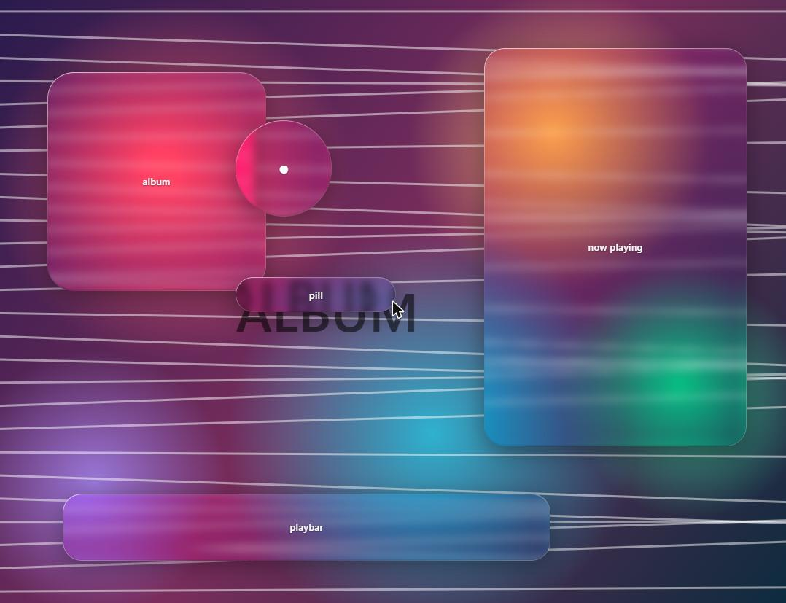

# glassliquify

[Liquify](https://github.com/NMWplays/Liquify) のフォーク。テーマのガラスを、
Backdrop の屈折・7タップ色収差・縁のハイライトを GLSL へ移植した WebGL 実装に
置き換える。



## これは何を変えるのか

Liquify のガラスは `backdrop-filter` と SVG の変位マップで作られている。その
変位マップは距離場ではなく box 全体にかかる線形グラデーションで、縁からの距離と
無関係に動く。色収差もチャンネルごとに `feDisplacementMap` の `scale` を変えて
おり、Chromium では副領域がずれてマップが完全に中立でも 1px の RGB ずれが出る。

このフォークは、背景がアルバムアート層だと分かっている面について、その背景を
自前で組み直して WebGL で描く。壁紙を描いてから面を奥から手前へ1枚ずつ描き、
描くたびにサンプル用テクスチャへ書き戻すので、カードは自分が乗っているパネルを
屈折できる。

- 屈折は距離から直接 `circleMap(1 - (-sd)/height) * amount`
- 色収差は 7 タップ (red/orange/yellow/green/cyan/blue/purple) の重み付き和
- 角は superellipse
- ぼかしは背景が静止しているので真の Gaussian を1回だけ焼く

移植が原典と一致することは `lab/verify.html` で画素単位に検証している。
`tools/gen-agsl.py` が AGSL の原文を機械抽出し、型名を置換したものと手書きの
移植版を同じ入力で描いて差分を取る。72000 画素で最大差 1/255。

## 使い方

```powershell
git clone https://github.com/satomasahiro2005/glassliquify
cd glassliquify
.\deploy.ps1
```

`Themes\Liquify-fork` として設置し、`current_theme` を切り替えて `spicetify apply`
まで走る。Spotify を再起動すれば効く。

- `Ctrl+Shift+G` でこのガラスと Liquify 標準を切り替え
- 上部バーの歯車の左にある設定ボタンで、クリア / 適応 / くもりのプリセットと
  各つまみ

詳細は [FORK.md](FORK.md)、権利表示は [NOTICE.md](NOTICE.md)。

## ライセンス

土台の Liquify が AGPL-3.0 なので全体も AGPL-3.0。シェーダの移植元である
Backdrop は Apache-2.0 で、どのファイルがどちらに由来するかは NOTICE.md に
書いてある。
