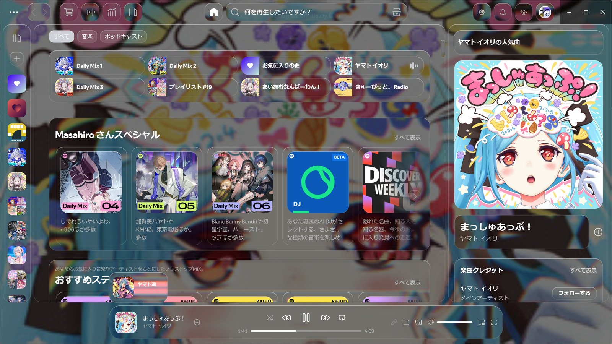
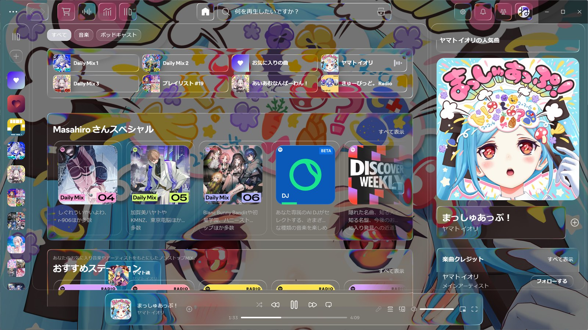
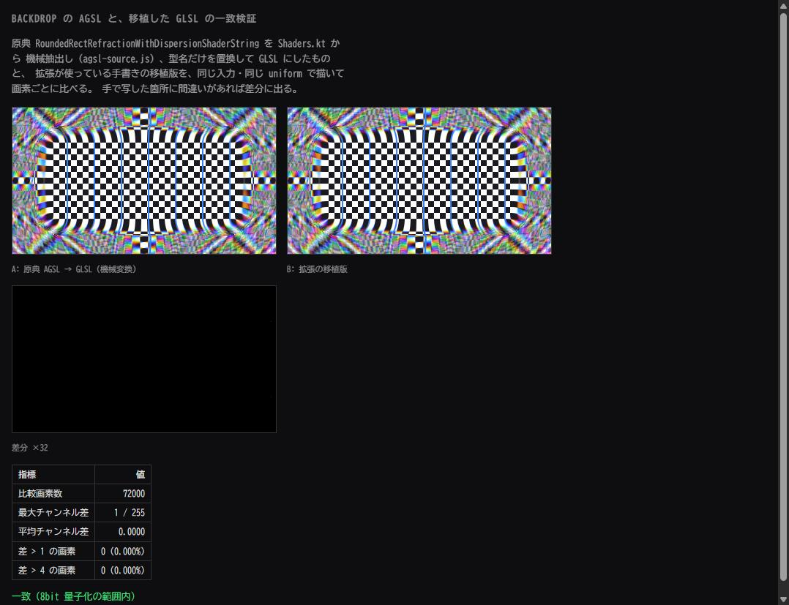

# glassliquify

[Liquify](https://github.com/NMWplays/Liquify) のフォーク。テーマのガラスを、
[Backdrop](https://github.com/Kyant0/AndroidLiquidGlass) の屈折・7タップ色収差・
縁のハイライトを GLSL へ移植した WebGL 実装に置き換える。

**Liquify 標準**



**このフォーク**



`Ctrl+Shift+G` でこの2つを切り替えられる。

---

## 何を差し替えるのか

Liquify のガラスは `backdrop-filter` と SVG の変位マップでできている。その変位
マップは距離場ではなく box 全体にかかる線形グラデーションで、縁からの距離とは
無関係に動く。縁が曲がるのではなく中身が平行移動する。

色収差も、チャンネルごとに `feDisplacementMap` の `scale` を変える作りになって
いる。Chromium では `scale` が変わるとフィルタの副領域が変わり、チャンネル面が
別々の画素に落ちる。**マップが完全に中立でも要素全面に 1px の RGB ずれが出る**
（全画素 128 のマップで再現して確認した）。

このフォークは、背景がアルバムアート層だと分かっている面について、その背景を
自前で組み直して WebGL で描く。壁紙を描いてから面を奥から手前へ1枚ずつ描き、
描くたびにサンプル用テクスチャへ書き戻すので、カードは自分が乗っているパネルを
屈折できる。

- 屈折量は距離から直接 `circleMap(1 - (-sd)/height) * amount`。形（`height`）と
  強さ（`amount`）が独立する
- 色収差は 7 タップ（red/orange/yellow/green/cyan/blue/purple）の重み付き和。
  各チャンネルの重みの合計は 1 なので明るさは変わらない
- 角は superellipse
- ぼかしは背景が静止しているので真の Gaussian を1回だけ焼く。Skia のぼかしは
  σ が大きいと三重ボックス近似なので、CSS に投げるより素直に良くなる
- 背景のカバーは CDN の 2000px 版を使う（API が返すのは 640px まで）

## 移植が原典と一致することの検証

`lab/verify.html` を開くと、その場で確認できる。`tools/gen-agsl.py` が Backdrop の
`Shaders.kt` から AGSL の原文を機械抽出し、型名だけを置換して GLSL にしたものと、
拡張が使っている手書きの移植版を、同じ入力・同じ uniform で描いて画素ごとに比べる。

**72000 画素で最大チャンネル差 1/255、平均 0.0000278、差が 1 を超える画素は 0。**



## 使い方

```powershell
git clone https://github.com/satomasahiro2005/glassliquify
cd glassliquify
.\deploy.ps1
```

`Themes\Liquify-fork` として設置し、`current_theme` を切り替えて `spicetify apply`
まで走る。Spotify を再起動すれば効く。素の `Liquify` はそのまま残るので、
`spicetify config current_theme Liquify` で戻せる。

- `Ctrl+Shift+G` — このガラスと Liquify 標準の切り替え
- 上部バーの歯車の左の設定ボタン — クリア / 適応 / くもりのプリセットと、
  屈折の幅・量、色収差、角の丸み、彩度、ぼかし、縁の光、光の角度など

詳細は [FORK.md](FORK.md)、権利表示は [NOTICE.md](NOTICE.md)。

## ライセンス

土台の Liquify が AGPL-3.0 なので全体も AGPL-3.0。シェーダの移植元である
Backdrop は Apache-2.0。どのファイルがどちらに由来するかは
[NOTICE.md](NOTICE.md) に書いてある。

---
---

以下は upstream の Liquify の README。

<h1 align="center"> ✨ Liquify Theme Spicetify ✨ </h1>

<p align="center">
  <b>A modern, rounded and liquified theme for spicetify</b><br>
</p>

## Contents

<!-- toc -->

- [Introduction](#introduction)
- [Theme screenshots](#theme-screenshots)
- [Features](#features)
<!-- tocstop -->

## Introduction

**Liquify** - is a glassmorphic Spicetify theme for Spotify featuring a modern, luminous interface and smooth animations.

Liquify is inspired by [Glassify](https://github.com/sanoojes/spicetify-glassify) from [Sanoojes](https://github.com/sanoojes).

If your transparent controls don’t look fully transparent — for example when zooming in on Spotify — you can easily change the width and height of them in the Glowify Settings to make them fully transparent again.

If you like the theme, consider starring the repository on GitHub! ⭐

**For support join the Discord!**:

<a href="https://discord.gg/QRMnrgjhvq" target="_blank">
  
</a>

## Theme screenshots

<details>
<summary>Click to watch screenshots</summary>


</details>

---

## Features

**Liquify offers:**

- Many customization options
-  `Beatiful Lyrics`, `Spicy Lyrics` and `Lucid Lyrics` are supported by default
- Beautiful dynamic colors (Just enable dynamic button colors in the settings and your good to go)
- Modern, rounded UI
- And much more!

## Credits

Created by NMW.

## License

This project is licensed under the GNU Affero General Public License v3.0 (AGPL-3.0). See the LICENSE file for details.
